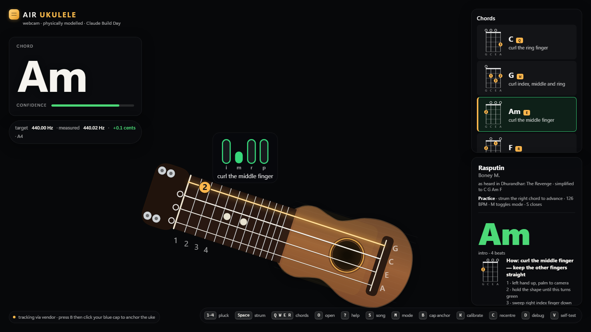

# Air Ukulele

**A webcam air ukulele in one HTML file. Your left hand makes the chord, your right finger strums, and the app proves every note is in tune.**

Built in one day at Claude Build Day, New Delhi, 19 September 2026 (Delight track), using Claude Code on Fable 5.1.



---

## 1. The problem

Learning an instrument has a cold-start problem. You need the instrument, you need to know where your fingers go, and you need someone to tell you whether it sounded right. Most people never get past the first hour.

Air-instrument apps have not solved this. They play canned recordings, so every strum is a button press. They see a hand waving but cannot say what the hand is doing wrong. And they ask you to trust that the sound is right.

**Who this is for:** someone curious about the ukulele who has a laptop and ten minutes, no instrument, and no teacher.

## 2. The solution

Open one file in Chrome, click Start, hold up your hands.

| Step | What the user does | What the app does |
|---|---|---|
| 1 | Left hand makes a chord shape | Recognises C, G, Am or F from finger curl and shows it large with a confidence bar |
| 2 | Right index finger sweeps across the on-screen strings | Plays the four notes in order, at the speed the finger actually moved |
| 3 | Listens | Synthesises the sound from a physical string model, tuned to a real ukulele, with a live tuner showing the error in cents |
| 4 | Presses **S** | Teaches Rasputin, four chords. Shows the hand shape, waits until it sees it, advances only on a correct strum |
| 5 | Presses **V** | Runs seven test suites in the browser and prints the results |

Zero install, zero hardware, zero account. Keyboard and mouse can drive everything if there is no camera.

## 3. What makes it different

| Typical air-instrument app | Air Ukulele |
|---|---|
| Plays recordings | Simulates the strings, then measures the pitch to prove it |
| Detects a hand waving | Knows which chord you meant and shows how to fix the shape |
| Toy | Teaches a song and only advances when you get it right |
| "Trust us" | Press V and watch the checks pass, with printed numbers |

## 4. Success criteria and evidence

The build rule was: every claim on screen must be backed by a printed number. Not green, not done.

| Claim | Check | Result on the shipped build |
|---|---|---|
| Tuning matches a real ukulele (gCEA, A4 = 440 Hz) | V1: tuning table computed from the fret table, compared to ground truth within 0.01 Hz | 20 of 20 notes pass |
| Every note sounds at the right pitch | V2: each note rendered offline, pitch measured by FFT, must be within 3 cents; harmonics at 2f and 3f present; note decays | 20 of 20 notes pass |
| A fast strum plays four distinct notes in order | V4: synthetic 60 ms sweep across two camera frames must produce 4 plucks, ordered, spanning 40 to 80 ms | Pass, plus 25 edge cases (upstroke, resting finger, glitches, debounce) |
| Chord recognition is correct | V8: one synthetic hand per rule row must classify correctly; mirrored and rotated hands must give identical results | 6 of 6 chords, invariance error 0.000 |
| Song data is playable | V9: every chord exists, bars are multiples of 4 beats, practice advances only on correct strums, play-along bars land within 10 ms | Pass |
| Body anchor tracks the right object | V10: synthetic frame with distractors, exactly one valid blob detected | Pass |
| On-screen fingering matches the chord table | V11: dots agree with frets, finger numbers unique, drawing does not throw | Pass |

Run it yourself: open `uke.html?selftest=1`, or press **V** in the app. The banner reads `ALL CHECKS PASS` or shows the first failure in red.

## 5. Scope decisions

The event gave about four hours of build time and a two-minute, zero-setup demo. Scope was locked at the start and held.

**In (MVP):** four-string engine, two-hand tracking, chord recognition for C, G, Am, F, sub-frame strum detection, velocity to loudness, live pitch readout, keyboard and mouse fallback, automated verification.

**Added after the MVP was green:** on-instrument fingering annotations, chord help panel, blue pen-cap body anchor so the instrument follows the player, Rasputin practice mode, and a position layer: the hand shape decides which chord you mean, but the chord only sounds when the fingertips are over the neck on the right dots. Off the dots you hear a damped thud and an arrow shows each finger where to go, so a correct shape in the wrong place never advances the song.

**Deliberately cut:** string vibration animation, pick-position tone, bridge coupling between strings, left-handed swap, more chords, lyrics. Each was either decorative, or a feature that could not be verified with a number in the time available.

**Why a ukulele, not a guitar:** four strings and four chords cover a real song, the rule-based chord recogniser stays simple enough to be explainable, and the demo fits in two minutes. The earlier guitar plan is kept in `ar-guitar-plan.md` for the engine design.

## 6. The hard problems, in plain words

- **A strum is faster than the camera.** Four strings are crossed in about 60 ms, which is two webcam frames. The app reconstructs the fingertip path between frames and computes the exact moment it crossed each string, then schedules four notes with the real timing. Detecting "finger inside a rectangle" cannot do this.
- **Feedback has to say what is wrong, not just that it is wrong.** Fingertips are mapped into the instrument's own coordinates and compared with the fingering dots, so the coaching hint can read "finger 3: up one string" rather than a red light.
- **Hands come in every size and angle.** Landmarks are re-centred on the wrist, rotated and scaled before anything is classified, so the same rule works for everyone and for a mirrored camera.
- **Realistic sound with zero samples.** Four physically modelled strings and a body resonance, rendered in an audio worklet. Pitch is verified by rendering offline and measuring the spectrum.
- **The instrument should follow the player.** Clip a blue pen cap to your shirt, press **B**, click the cap once. The instrument tracks your body in position and size.

## 7. How to run

**Online (simplest):** double-click `dist/Air-Ukulele.html` in Chrome, click Start, allow the camera. The hand tracker loads once from the MediaPipe CDN and is cached.

**Offline:** run `run.bat`. It starts a local server and opens `http://localhost:8000/uke.html` with the tracker served from `vendor/`.

**Keys:** `?` help · `S` song · `M` practice or play-along · `B` cap anchor · `K` calibrate · `V` self-test · `Q W E R` force C G Am F · `Space` strum · `1-4` pluck.

## 8. Known limitations and what I would do next

- Chord recognition is rule-based on four finger curls. It is robust and explainable but limited to shapes that differ by which fingers are curled. An optional 15-second calibration (key **K**) stores per-user hand shapes and is expected to be needed for more chords.
- Tested on one laptop webcam at 1280x720 in Chrome. Other browsers and low light are untested.
- The pen-cap anchor, the calibration flow and song practice with hand strums passed automated tests but have had limited live testing.
- Next: user testing with five beginners to measure time-to-first-correct-chord, then expand to the eight chords that cover most beginner songs.

## 9. How it was built

The project was written as a contract first (`CLAUDE.md`): twelve module boundaries, exact message formats, the ground-truth frequency table, and the test each module had to pass before the next phase could start. Claude Code then built modules in parallel against that contract, with a headless Chrome runner so audio could be verified without speakers or a display.

Three things worth noting for anyone evaluating AI-assisted delivery:

1. **Contract before code.** Interfaces and acceptance tests were fixed up front. Modules integrated on the first build.
2. **No green, no progress.** A flaky pitch test was traced to a root cause (random noise in the string excitation occasionally making the second harmonic louder than the fundamental) and fixed on both sides rather than by widening the tolerance.
3. **Platform quirks written down.** Chrome's `file://` restrictions on modules, wasm and worklets were each found, worked around, and recorded in the contract so they were never rediscovered.

## Repository layout

```
uke.html              the deliverable, built from src/ (no runtime build step)
dist/Air-Ukulele.html the submission copy with a how-to-run header
src/*.js              one file per module: audio, tuning, tracking, chord, strum, annot, anchor, songs, main
src/build.js          concatenates src/ into uke.html
src/headless-run.js   drives headless Chrome through the self-test and prints the report
vendor/               MediaPipe tasks-vision 0.10.x for offline use (the only external dependency)
run.bat               offline launcher
CLAUDE.md             the build contract
architecture.md       architecture and MVP scope
pitch.md              the two-minute demo script
```

No frameworks, no audio samples, one external dependency.
