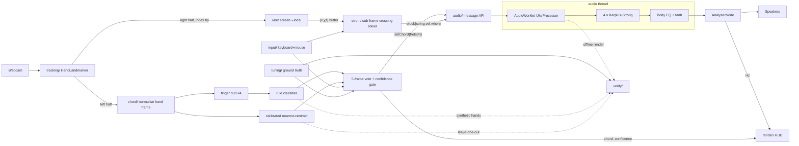

# Air Ukulele — Architecture and MVP Scope

Companion to `CLAUDE.md` (the contract). Scope locked with the user on 19 Sept 2026: **ukulele, chords C G Am F, chord recognition from hand shape with rules by default and optional calibration.**

---

## 1. High-level architecture

One browser tab, one file. Two threads: the **main thread** (camera, tracking, chord recognition, geometry, rendering) and the **audio thread** (synthesis in an AudioWorklet). They talk only through timestamped messages.

```
┌────────────────────────────────────────────────────────────────────────────┐
│  uke.html  (Chrome, file://)                                               │
│                                                                            │
│  MAIN THREAD                                                               │
│                                                                            │
│  ┌─────────┐  frames  ┌──────────────────┐  2 hands × 21 landmarks         │
│  │ Webcam  │────────▶ │    tracking/     │────────────┬──────────────┐     │
│  │ <video> │          │ MediaPipe Hand-  │            │              │     │
│  └────┬────┘          │ Landmarker       │   left half│    right half│     │
│       │               │ role by side     │   = fretting   = strumming│     │
│       │               └──────────────────┘            │              │     │
│       │                                               ▼              ▼     │
│       │                    ┌────────────────────────────┐  ┌──────────────┐│
│       │                    │          chord/            │  │    uke/      ││
│       │                    │ 1. normalise hand frame    │  │ fixed frame  ││
│       │                    │    (wrist origin, rotate,  │  │ screen→local ││
│       │                    │     scale)                 │  │ 4 string     ││
│       │                    │ 2. finger curl × 4         │  │ lines        ││
│       │                    │ 3. rules  ──or──  nearest  │  └──────┬───────┘│
│       │                    │    centroid (calibrated)   │         │ tip    ││
│       │                    │ 4. 5-frame majority vote   │         │(x,y,t) ││
│       │                    └─────────────┬──────────────┘         ▼        │
│       │                                  │ chord, confidence ┌────────────┐│
│       │                                  │                   │   strum/   ││
│       │                                  │                   │ sub-frame  ││
│       │  ┌──────────┐                    │                   │ crossing   ││
│       │  │  input/  │ Q W E R force chord│                   │ solver     ││
│       │  │ keyboard │────────────────────┤                   │ velocity→  ││
│       │  │ + mouse  │ 1–4, Space, drag ──┼──────────────────▶│ amplitude  ││
│       │  └──────────┘                    │                   │ debounce   ││
│       │                                  │                   └─────┬──────┘│
│       │                                  │ setChord{frets[4]}      │ pluck ││
│       │                                  ▼                         ▼{str,  ││
│       │                    ┌────────────────────────────────────────┐vel,  ││
│       │                    │        audio/  port.postMessage        │when} ││
│       │                    └───────────────────┬────────────────────┘      │
│  ─────┼──────────────────────────────────────── ┼ ─────────────────────     │
│       │  AUDIO THREAD (AudioWorklet)            ▼                          │
│       │                    ┌────────────────────────────────────────┐      │
│       │                    │             UkeProcessor               │      │
│       │                    │  ┌──────┐ ┌──────┐ ┌──────┐ ┌──────┐   │      │
│       │                    │  │ G4   │ │ C4   │ │ E4   │ │ A4   │   │      │
│       │                    │  │ KS   │ │ KS   │ │ KS   │ │ KS   │   │      │
│       │                    │  │frac Δ│ │frac Δ│ │frac Δ│ │frac Δ│   │      │
│       │                    │  └──┬───┘ └──┬───┘ └──┬───┘ └──┬───┘   │      │
│       │                    │     └────────┴────┬───┴────────┘       │      │
│       │                    │              ┌────▼─────┐              │      │
│       │                    │              │  Body    │              │      │
│       │                    │              │ 2 biquad │              │      │
│       │                    │              │ + tanh   │              │      │
│       │                    │              └────┬─────┘              │      │
│       │                    └───────────────────┼────────────────────┘      │
│       │                                        ▼                           │
│       │                            ┌──────────────────┐                    │
│       │                            │  AnalyserNode    │──▶ 🔊 speakers     │
│       │                            │  live pitch (V5) │                    │
│       │                            └────────┬─────────┘                    │
│       ▼                                     ▼ measured Hz                  │
│  ┌──────────────────────────────────────────────────────────────────┐      │
│  │ render/  canvas overlay: strings, landmarks, CHORD NAME (large), │      │
│  │ confidence bar, curl values, target/measured/cents               │      │
│  └──────────────────────────────────────────────────────────────────┘      │
│  ┌──────────────────────────────────────────────────────────────────┐      │
│  │ verify/  ?selftest=1: V1 tuning · V2 pitch (offline render+FFT) │      │
│  │ · V4 rake ordering · V8 chord rules + calibration confusion mtx  │      │
│  └──────────────────────────────────────────────────────────────────┘      │
└────────────────────────────────────────────────────────────────────────────┘
```

### Data flow (Mermaid)



### Two timing contracts

1. **Strum.** Camera frames arrive every ~33 ms; a strum crosses four strings in ~60 ms. `strum/` solves each string's crossing time between the last two frames and sends four messages with `when` values 10–20 ms apart. Absolute latency (~60–100 ms) is accepted in the MVP; relative timing is exact.
2. **Chord.** Recognition runs every frame but the output only changes when 3 of the last 5 frames agree and confidence ≥ 0.5. A chord change retunes strings for the next pluck, never mid-ring.

---

## 2. MVP scope (locked)

Smallest thing that satisfies the brief: *detect the hands, recognise which chord I am trying to play, strum it, hear a real ukulele, and prove both the sound and the recognition with numbers.*

### In

| Area | Included |
|---|---|
| Shell | `uke.html`, Start button, mirrored camera full-screen |
| Synthesis | 4 Karplus-Strong strings, fractional delay, body EQ, soft limiter |
| Tuning | gCEA, chords **C G Am F** + open + mute |
| Tracking | MediaPipe, 2 hands, roles by screen side |
| **Chord recognition** | Hand-normalised frame → finger curl → rule table; 5-frame vote; confidence bar. **Optional calibration** (key K) that overrides rules with nearest-centroid, saved to localStorage |
| Geometry | Fixed on-screen instrument, screen → local transform, **C** to recentre |
| Strum | Sub-frame crossing solver, velocity → loudness, 40 ms debounce |
| Fallback | Keyboard 1–4 / Q W E R / O / Space, mouse drag strum |
| Visuals | Strings, landmarks, large chord name + confidence bar, curl readout, pitch readout. No animation |
| Verification | **V1** tuning table · **V2** pitch ≤ 3 cents + harmonics + decay · **V4** rake ordering · **V5** live pitch · **V8** rule classifier on synthetic hands + calibration confusion matrix ≥ 90% |

### Deferred to v1.1

Bridge coupling · pick-position comb · pick hardness · string vibration animation · song prompt (next chord highlight) · neck-zone chord select as alternate mode · left-hand swap · V3 chord spectrum · V7 stability.

### Deferred to v2

Predictive triggering + latency slider · more chords (G7, Dm, Em) · bundling MediaPipe as base64.

### MVP acceptance test

1. Double-click `uke.html`, click Start. Camera and instrument visible within 5 s.
2. `?selftest=1` → V1, V2, V4, V8 (rules) all green.
3. Make a C shape with the left hand (ring finger down). HUD reads **C** with confidence ≥ 0.5 within half a second. Repeat for G, Am, F, open. No flicker while holding.
4. Sweep the right index finger down across the strings. Four notes of the shown chord sound in order with an audible rake; debug HUD shows four plucks with increasing timestamps.
5. Live readout after a single pluck shows |cents| ≤ 3 in green.
6. Press K, calibrate 5 shapes (15 s). V8 prints a confusion matrix ≥ 90%. Recognition now uses calibration.
7. Deny camera. Keyboard and mouse still play the full instrument.

### Build order and budget

```
Phase 1  shell + camera + worklet loads              ~15 min
Phase 2  tuning/ + V1                                ~10 min
Phase 3  4-string engine, keyboard, V2 V5            ~35 min
Phase 4  tracking + landmarks + mouse strum          ~30 min
Phase 5  chord/ rules + vote + HUD, V8 rules         ~30 min
Phase 6  instrument frame + crossing solver, V4      ~30 min
Phase 7  calibration flow + V8 confusion matrix      ~25 min
                                                     ≈ 2 h 55 → ~50 min for v1.1 and rehearsal
```

### Demo beat (the 20 seconds that matter)

Hold up the left hand, make a C. The screen says **C**. Change to G. It says **G**. Strum. It sounds like a ukulele playing G, and the readout says the pitch is within two cents of a real one. Hand it to a judge.
